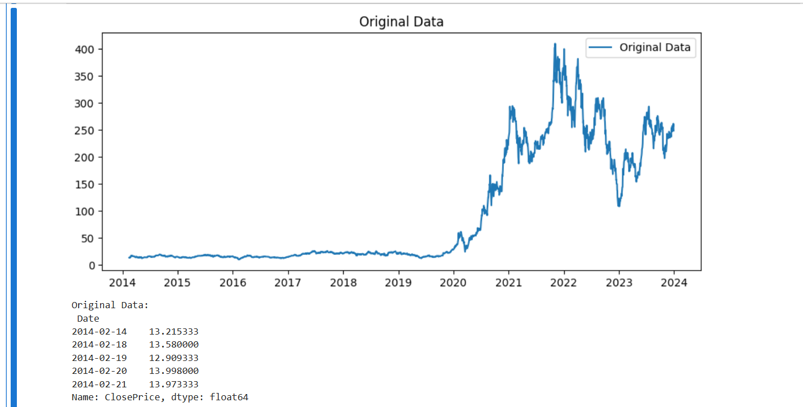
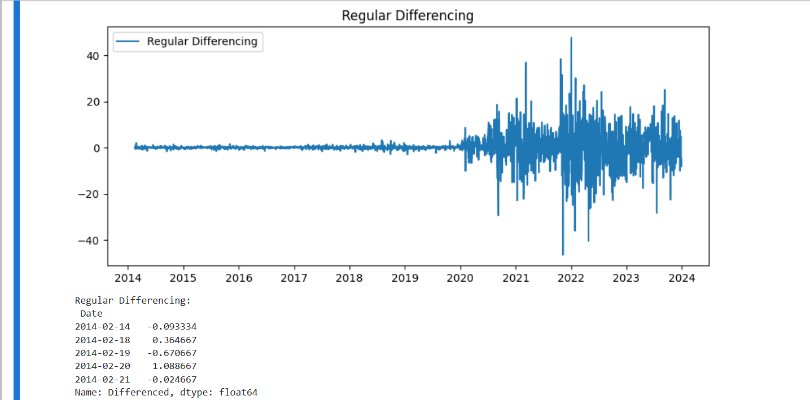
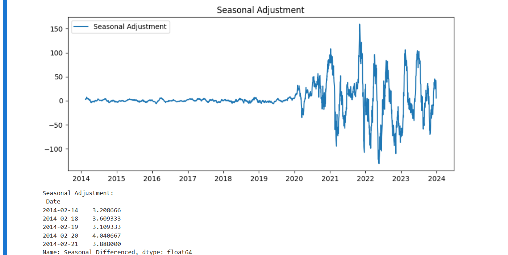
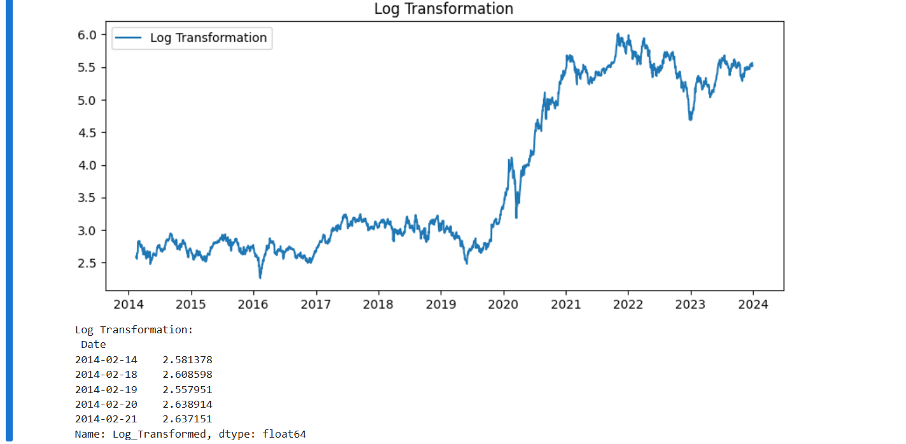

### Developed by: Pranave B
### Register Number: 212221240040


# Ex.No: 1B CONVERSION OF NON STATIONARY TO STATIONARY DATA
### AIM:
To perform regular differncing,seasonal adjustment and log transformatio on international airline passenger data
### ALGORITHM:
1. Import the required packages like pandas and numpy
2. Read the data using the pandas
3. Perform the data preprocessing if needed and apply regular differncing,seasonal adjustment,log transformation.
4. Plot the data according to need, before and after regular differncing,seasonal adjustment,log transformation.
5. Display the overall results.


### PROGRAM:

```python
import pandas as pd
import numpy as np
import matplotlib.pyplot as plt

file_path = 'tsla_2014_2023.csv'
data = pd.read_csv(file_path)

# Select the date and close columns, rename for consistency
data = data[['date', 'close']]
data.rename(columns={'date': 'Date', 'close': 'ClosePrice'}, inplace=True)

# Convert Date to datetime and set as index
data['Date'] = pd.to_datetime(data['Date'])
data.set_index('Date', inplace=True)

# Apply differencing and transformations
data['Differenced'] = data['ClosePrice'].diff()
seasonal_period = 30
data['Seasonal_Differenced'] = data['ClosePrice'].diff(seasonal_period)
data['Log_Transformed'] = np.log(data['ClosePrice'])
data.dropna(inplace=True)

# Define columns to plot
columns_to_plot = {
    'Original Data': 'ClosePrice',
    'Regular Differencing': 'Differenced',
    'Seasonal Adjustment': 'Seasonal_Differenced',
    'Log Transformation': 'Log_Transformed'
}

# Plot each transformation
for title, column in columns_to_plot.items():
    plt.figure(figsize=(10, 4))
    plt.plot(data[column], label=title)
    plt.title(title)
    plt.legend()
    plt.show()
    print(f"{title}:\n", data[column].head())

```


### OUTPUT:



#### REGULAR DIFFERENCING:



#### SEASONAL ADJUSTMENT:



#### LOG TRANSFORMATION:




### RESULT:
Thus we have created the python code for the conversion of non stationary to stationary data on international airline passenger
data.
